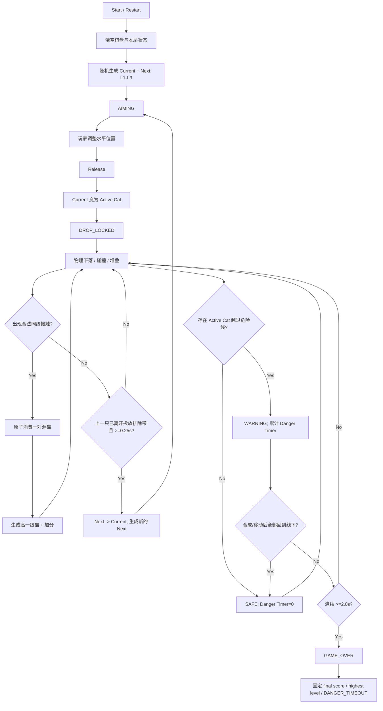

# Core Gameplay Flow v0.1

- Task ID: `GAME-002-CORE-GAMEPLAY-PRD`
- Related PRD: `CORE_GAMEPLAY_PRD_v0.1.md`
- Status: `USER_APPROVED`

## 1. 单局主流程

## 2. 正交状态说明

核心玩法不要把所有状态压成一个单一枚举。产品语义上至少存在三组互相独立的状态：

### Run State
`RUNNING -> GAME_OVER`

- `RUNNING`：允许物理、合成、计分和投放状态变化。
- `GAME_OVER`：停止新投放和新增合成计分，等待结算流程。

### Spawn State
`AIMING -> DROP_LOCKED -> AIMING`

- `AIMING`：Current 可水平调整并释放。
- `DROP_LOCKED`：上一只刚释放；等其离开投放排除带且至少经过0.25秒后解锁下一次 AIMING。

### Danger State
`SAFE -> WARNING -> SAFE` 或 `WARNING -> GAME_OVER`

- `SAFE`：Danger Timer = 0。
- `WARNING`：至少一只有效猫越线，连续计时。
- 任意时刻全部回到线下，立即返回 SAFE 并清零。
- WARNING 连续达到2秒且合成结算后仍越线，进入 GAME_OVER。

## 3. 合成事件顺序

单个逻辑结算周期按以下产品顺序处理：

1. 取得本周期物理接触结果。
2. 找出合法同级接触候选。
3. 对每个源猫执行“最多消费一次”约束。
4. 消费合法配对的两个源猫。
5. 生成对应高一级猫。
6. 为每次成功合成增加对应分值。
7. 新生成猫从下一次合成结算步骤起可继续参与合成。
8. 基于结算后的有效猫集合更新危险线状态。
9. 最后判断 Danger Timer 是否达到2秒并触发 Game Over。

这保证临界时刻的合法合成可以先清除危险状态，不会出现“已经合成成功但仍按旧对象判死”。

## 4. 三体同时接触示例

假设三个 L3 同时互相接触：A、B、C。

- 允许：A+B -> L4，C 保持 L3。
- 也允许：A+C -> L4，B 保持 L3。
- 不允许：A+B+C -> L4。
- 不允许：A 同时与 B、C 各合成一次。
- 不允许：一次接触产生两个 L4 或重复加分。

具体配对优先级由 Tech Design 选择确定性策略，但玩家可见规则必须保持一致。

## 5. 危险线恢复示例

1. 猫咪 X 的碰撞体越过危险线，进入 WARNING，计时开始。
2. 计时到 1.7 秒时，X 与同级猫合成。
3. 两个源猫被消费，新猫生成后位于危险线以下。
4. 本周期合成完成后重新检查危险区，发现已无猫越线。
5. Danger Timer 清零，回到 SAFE，本局继续。

## 6. 暂停 / 后台

外部 UX 或平台生命周期把核心游戏置于暂停时：
- 物理模拟不推进。
- 合成结算不推进。
- Danger Timer 不推进。
- Spawn 最小0.25秒锁定计时不应按真实世界后台时间跳过；恢复后继续按游戏时间推进。

具体暂停按钮、平台事件和恢复界面不属于本流程文档范围。
